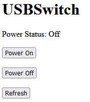

Code examples for 8086 Consultancy USB Power Switch Pro

Most of the examples here currently are for CircuitPython 8, see https://learn.adafruit.com/getting-started-with-raspberry-pi-pico-circuitpython/circuitpython to get the latest CircuitPython onto your Pico / Pico W.

## Examples

# Slide (or Toggle) Switch  [ for Pico / Pico W ]

Basic example which provides similar functionality to our original USB Power Switch but uses an internal Pull Up resistor.

Example code: [CircuitPython](CircuitPython/slide-switch/)

# Momentary Push Button [ for Pico / Pico W ]

Push to turn on / push to turn off, latched in software with configurable initial state.

Example code: [CircuitPython](CircuitPython/momentary-push/)

# Wifi Buttons [ for Pico W ]

Shows a simple website with buttons to toggle power on/off.

Example code: [CircuitPython](CircuitPython/wifi-buttons/)
