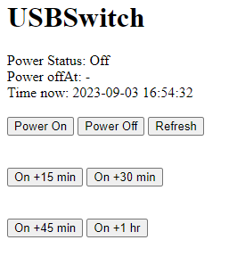

Code examples for 8086 Consultancy USB Power Switch Pro

Most of the examples here currently are for CircuitPython 8, see https://learn.adafruit.com/getting-started-with-raspberry-pi-pico-circuitpython/circuitpython to get the latest CircuitPython onto your Pico / Pico W.

## Examples

# Slide (or Toggle) Switch  [ for Pico / Pico W ]

Basic example which provides similar functionality to our original USB Power Switch but uses an internal Pull Up resistor.

Example code: [CircuitPython](CircuitPython/slide-switch/)

# Momentary Push Button [ for Pico / Pico W ]

Push to turn on / push to turn off, latched in software with configurable initial state.

Example code: [CircuitPython](CircuitPython/momentary-push/)

# Wifi Buttons [ for Pico W ]

Shows a simple website with buttons to toggle power on/off.

Example code: [CircuitPython](CircuitPython/wifi-buttons/)

# Internal Temperature Sensor [ for Pico / Pico W ]

Turns USB port on at a set temperature and off when it has decresed a set number of degrees C.

Example code: [CircuitPython](CircuitPython/internal-temp/)

# Wifi Boost [ for Pico W ]

Provides a website with On/Off/Refresh buttons at the top and On/Boost buttons for +15/30/45/60 minutes increments.

Example code: [CircuitPython](CircuitPython/wifi-boost/)

# Wifi RESTful Switch

An untested example for Home Assistant users wishing to integrate the USB Power Switch Pro

Example code: [CircuitPython](CircuitPython/wifi-RESTfulSwitch/)

#  WiFi MQTT Switch ProM [ for PicoW on ProM ]

Turns power on/off using MQTT topic subscription.

Periodically sends power usage information (voltage/current/power) over MQTT.

Both of these aim to be compatible with Tasmota MQTT topics ("cmnd/USBSW/POWER" and "tele/USBSW/SENSOR") and formats.

Example code: [CircuitPython](CircuitPython/wifi-mqtt-switch-prom/)
